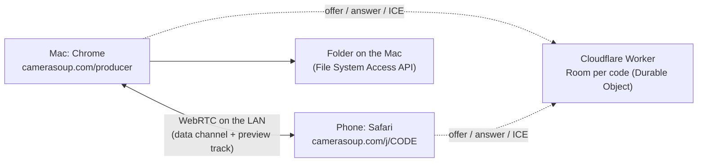

# camerasoup.com: the hosted product

The product ships as a website. Nothing is installed on the Mac or the
phone; the browser is the shell on both ends.



- **`worker/`** is the whole backend: it serves `studio/dist` as static
  assets and relays WebRTC signaling between a producer tab and its cameras.
  One `Room` Durable Object per join code, WebSocket hibernation, no
  storage. Footage never touches it — once two browsers have exchanged
  offers they talk directly.
- **STUN only** (`stun.cloudflare.com`, free and unlimited). There is
  deliberately no TURN relay configured, so the product can never cost
  bandwidth. If a network blocks device-to-device traffic, the check says
  so instead of silently relaying. A relay is a paid feature for later; it
  slots in via `/api/ice` without a page change.
- **`Stats`** Durable Object keeps an anonymous tally of check verdicts
  (`GET /api/verdicts`): the share of real networks that get a direct
  connection decides whether that relay tier is worth building.

Everything fits in the Workers Free plan; see the cost notes in the chat
history summarized in the README.

## The connection check

`/check` on the Mac shows a QR; `/j/<code>` on the phone joins. The check
is the same handshake the studio uses, so passing it means recording will
work:

1. Mac side probes the browser: folder access, WebCodecs h264 + AAC, and a
   short 1080×1350 encode benchmark (hardware encoders manage hundreds of
   fps, software around fifty; Chrome no longer exposes a hardware flag).
2. Phone side opens the camera, joins the room, answers the offer.
3. The Mac measures round trip and has the phone push random bytes over the
   data channel for five seconds, then reads which ICE path was chosen.
4. Verdict in cameras, not megabits: green (direct path, ≥2 cameras at
   1080p), yellow (limits), red (won't work), with a diagnostics copy button
   and the same card on both screens.

Query params: `/check?code=ABC123` pins the room code; `/j/CODE?nocam`
skips the camera so a second desktop tab can stand in for a phone.

Backpressure and waits are event driven (`bufferedamountlow`, encoder
`dequeue`), never timers: Chrome throttles timers in background tabs to one
tick per second, which silently caps any timer-paced test at a few Mbps.

## Deploying

```sh
npm run deploy        # builds studio/dist, then wrangler deploy from worker/
npm run tail -w worker
```

Wrangler uses the OAuth login from `wrangler login`. Deploys restart the
Durable Objects, which drops open signaling sockets; the `Signal` client
rejoins the same room automatically, so open pages keep their codes.

Domains: `camerasoup.com` and `www.camerasoup.com` are Workers custom
domains (Cloudflare manages DNS and the certificate);
`camerasoup.andreas-35a.workers.dev` stays enabled for testing.

## What comes next

In order of risk: port the producer and camera pages onto the same rooms
(data channel carries the MediaRecorder chunks, a low-bitrate video track
replaces JPEG previews), write chunks into a user-chosen folder in segments
so a crashed tab loses seconds rather than a take, remux at stop with a JS
muxer, then the WebCodecs render engine. The Node server and ffmpeg path in
`server/` stay as the local fallback until the browser render reaches
parity.
