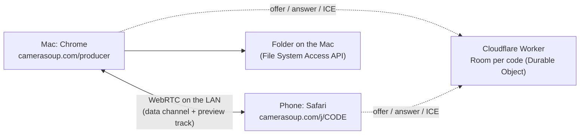

# camerasoup.com: the hosted product

The product ships as a website. Nothing is installed on the Mac or the
phone; the browser is the shell on both ends.



- **`worker/`** is the whole backend: it serves `studio/dist` as static
  assets and relays WebRTC signaling between a producer tab and its cameras.
  One `Room` Durable Object per join code, WebSocket hibernation, no
  storage. Footage never touches it — once two browsers have exchanged
  offers they talk directly.
- **STUN only** (`stun.cloudflare.com`, free and unlimited). There is
  deliberately no TURN relay configured, so the product can never cost
  bandwidth. If a network blocks device-to-device traffic, the check says
  so instead of silently relaying. A relay is a paid feature for later; it
  slots in via `/api/ice` without a page change.
- **`Stats`** Durable Object keeps an anonymous tally of check verdicts
  (`GET /api/verdicts`): the share of real networks that get a direct
  connection decides whether that relay tier is worth building.

Everything fits in the Workers Free plan; see the cost notes in the chat
history summarized in the README.

## The connection check

`/check` on the Mac shows a QR; `/j/<code>` on the phone joins. The check
is the same handshake the studio uses, so passing it means recording will
work:

1. Mac side probes the browser: folder access, WebCodecs h264 + AAC, and a
   short 1080×1350 encode benchmark (hardware encoders manage hundreds of
   fps, software around fifty; Chrome no longer exposes a hardware flag).
2. Phone side opens the camera, joins the room, answers the offer.
3. The Mac measures round trip and has the phone push random bytes over the
   data channel for five seconds, then reads which ICE path was chosen.
4. Verdict in cameras, not megabits: green (direct path, ≥2 cameras at
   1080p), yellow (limits), red (won't work), with a diagnostics copy button
   and the same card on both screens.

Query params: `/check?code=ABC123` pins the room code; `/j/CODE?nocam`
skips the camera so a second desktop tab can stand in for a phone.

Backpressure and waits are event driven (`bufferedamountlow`, encoder
`dequeue`), never timers: Chrome throttles timers in background tabs to one
tick per second, which silently caps any timer-paced test at a few Mbps.

## Deploying

```sh
npm run deploy        # builds studio/dist, then wrangler deploy from worker/
npm run tail -w worker
```

Wrangler uses the OAuth login from `wrangler login`. Deploys restart the
Durable Objects, which drops open signaling sockets; the `Signal` client
rejoins the same room automatically, so open pages keep their codes.

Domains: `camerasoup.com` and `www.camerasoup.com` are Workers custom
domains (Cloudflare manages DNS and the certificate);
`camerasoup.andreas-35a.workers.dev` stays enabled for testing.

## Roles: the computer records, anything controls

Recording needs a folder on disk and a hardware encoder, so the hub runs in
a desktop Chromium tab. Everything you *do* during a take is small, so the
control surface is separate and can run anywhere:

| Page | Who | Does |
|---|---|---|
| `/studio` | the recording computer | owns the room, receives footage, writes files, keeps the clock |
| `/j/<code>` → camera | phone, tablet, spare laptop | sends a preview track and, while recording, full-quality chunks |
| `/j/<code>` → remote control | an iPad, or the studio's own screen | sees every camera, presses REC, cuts the show |
| `/j/<code>` → check | any device | the ten-second connection test |

`ControlView` is one component rendered from either the hub's own state or a
snapshot received over a data channel, so the iPad and the Mac cannot drift
apart.

Per camera the hub opens two data channels — `control` (JSON) and `media`
(ordered raw bytes) — plus one receive-only video transceiver for the
preview. A control view gets a `control` channel and a forwarded copy of
every camera's track, matched to cameras by MediaStream id.

## Recording to disk

Chrome commits a `FileSystemWritableFileStream` only on `close()`, so a tab
that dies mid-take would lose everything. Footage is written as closed
segments of 16 MB (`SegmentWriter`) and stitched into one file at stop: a
crash costs seconds, not the take. The session folder and `session.json`
match the local server's format exactly, so the existing editor and ffmpeg
render still work on browser-recorded sessions.

Clock sync is unchanged in spirit: cameras ping the hub over the control
channel, take the median offset, and report their recorder start on the hub
clock. Live cuts are logged in hub-clock milliseconds and converted to
timeline frames at finalize.

## Testing without hardware

Two hooks, test-only, never shipped as features:

- `?fs=opfs` puts recordings in the origin-private file system, so no
  native folder dialog is needed.
- `?fake=1` substitutes a moving canvas for the camera or screen, so no
  permission prompts are needed.

`/studio?code=X&fs=opfs&fake=1` plus `/j/X?mode=camera&fake=1` drives a
whole session in two tabs.

## Editing and rendering

`/edit` reads the same session folder. `session-store.ts` puts one interface
over two backends — the folder (File System Access) on the website, the Node
server in the local app — so the editor itself doesn't know which it is
talking to. Video files become blob URLs; an edit is merged into the
manifest on disk rather than overwriting it, so durations and file names
survive.

The render (`render-browser.ts`) is pure browser. Mediabunny demuxes each
angle and decodes it with WebCodecs, every output frame is composited onto
one canvas and encoded with the Mac's hardware h264 encoder, and the result
is muxed to MP4 with AAC audio, written next to the footage as
`out-4x5.mp4` and `out-9x16.mp4`. It renders segment by segment so each
angle's packets are decoded once, and it reuses the same `buildTimeline()`
the editor previews — what you see is what renders. The bundle is loaded on
demand, so the camera page never downloads it.

Measured: an 11.3 s two-angle session rendered to both formats in under
10 seconds, verified as 1080×1350 and 1080×1920 playable MP4s.

## What comes next

Audio through the render is written but untested — the automated tests use
silent canvas sources. The Node server and ffmpeg path in `server/` stay as
the local fallback, and `server/` remains the only way to render a session
that lives outside the browser's folder.
